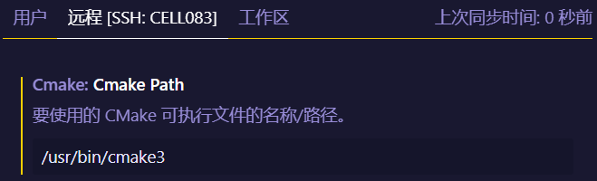

# 快速设置服务器

## 为什么使用云服务
如果只是为了学习Linux的技能，从省钱的角度来说，在电脑上安装虚拟机应该是更合理的选择。但是现在云服务价格非常合理，而且这个系列以目标为导向的任务机制，在云服务上的操作能够立刻看到效果，而且只要有网络，就算一部iPad也能工作，这部分的费用付出是值得的。</br>

由于工作的关系经常需要在太平洋两边跑来跑去，所以我在国内和美国各申请了一台云服务器。在美国我使用的是 Amazon 的 Lightsail 服务，申请的服务器是一台1G内存的服务器，每个月大概5美金的租金。安装的操作系统是 Amazon Linux 2，这个版本的 Linux 是 CentOS 一个二进制兼容版本，大部分 CentOS 的指令和配置方法都是兼容 Amazon Linux 的。Amazon Linux 2 的支持周期已经延长到了2025年。</br>

而国内腾讯的云服务器我安装的版本是 Ubuntu Linux 22.04 LTS 版本。安装这个版本的 Linux，一个原因是服务的支持周期比较长，可以到2032年，另外一个原因是有部分 Ubuntu 的配置方法和设置与 CentOS 稍微有区别，软件的版本也不太一样，这样可以对照来使用。</br>

这两个 Linux 版本都安装了以下的基本服务：
1. ssh，用于远程登陆；
2. VS Code Server，用于在不同的地点获得比较快速的连接服务能力；
3. miniconda，一个 python 的多版本管理工具，安装的python 版本是3.10；
4. gcc编译器，Lightsail 的版本是7.3.1，腾讯的版本是 9.4.0；
5. cmake，Lightsail 的版本是3.13，腾讯的版本是<待定>；
6. git 版本控制，用来和 github 进行同步，方便在任何地方都可以获得最新的文档和程序版本；
</br></br>

## 服务器基本配置
安装好服务的操作系统后，需要完成以下四个事情：
1. 配置常用的用户登录名；
2. 配置ssh，方便远程登陆；
3. 安装miniconda，安装最新的 python 版本；
4. 安装 gcc 和 cmake 组件，使得服务器具备 c/c++ 编译的能力；

### 配置常用的用户登录名
``` bash
// CentOS：新增一个用户
# useradd <用户名>

// Ubuntu：新增一个用户
# adduser <用户名>
# useradd -m <用户名>	// 需要 -m 参数，否则不会创建家目录

// Ubuntu：删除一个用户
# sudo killall -u <用户名>  // 退出用户发起的进程
# sudo deluser --remove-home -f <用户名>    // 删除用户及其目录
```

</br>

### 配置ssh，方便远程登陆
``` bash
// 腾讯默认安装的用户是ubuntu，当绑定完ssh的密钥对后，可以先用ubuntu登陆，clt表示客户机，比如 Windows 下的 wsl，ami表示的是类 cos 系统
clt$ ssh ubuntu@<服务器ip>
ubt$ sudo adduser jamesl    // ubuntu增加一个常用的用户，例子中用户名为 jamesl，以后我们就用这个用户名登陆 ubuntu
cos$ sudo useradd jamesl    // 类 centos 系统使用的是 useradd 增加用户
ubt$ sudo passwd jamesl     // 修改刚刚增加的用户的密码
// ubuntu 系统，将刚刚增加的 jamesl 加入 sudo 组中
ubt$ sudo usermod -aG sudo jamesl  
// 类 centos 系统，使用如下命令将用户加入 sudo 组中
cos$ sudo usermod –aG wheel jamesl
ubt$ su - jamesl
ubt$ mkdir .ssh
ubt$ chomd 700 .ssh
ubt$ cd ssh
ubt$ touch authorized_keys
ubt$ chmod 600 authorized_keys
// 将之前产生私钥所相对应的公钥 copy 到 authorized_keys 中


// 可以远程登录这部机器中
clt# ssh jamesl@ubt

```
</br>
</br>

### 安装 miniconda
``` 
```
</br></br>

### 安装 gcc 和 cmake 组件
``` bash
// 类 CentOS 系统
sudo yum groupinstall "Development Tools"
sudo yum install cmake3    // 安装 cmake 3.13

// Amazon Linux：修改登陆用户的.bashrc文件，让 cmake 指向安装的cmake3
alias cmake=cmake3

// 为了在 VSCode 中正常使用新安装的 cmake3，还需要如下设置


// ubuntu 系统
// ubuntu 22.04 默认已经安装了gcc 11.2+
sudo yum install cmake     // 安装 cmake 3.22+
```

针对 Amazon 提供的类 CentOS 系统，由于 cmake 3.x 安装为 cmake3，需要在 VS Code 中进行设置 cmake 设置。


</br>

## VS Code的基本配置
1. 在 VS Code客户端的用户家目录下配置
2. 按下 `ctrl+shift+p` 打开 VS Code 设置，输入remote，选择需要连接的远端服务器
3. 平台选择 Linux，如果是通过 ssh 连接，vs code 会提示输入密码；
4. 完成连接后，vs code会自动在远端服务器用户的家目录中，下载和安装vscode server，安装位置为 `~/.vscode-server`
